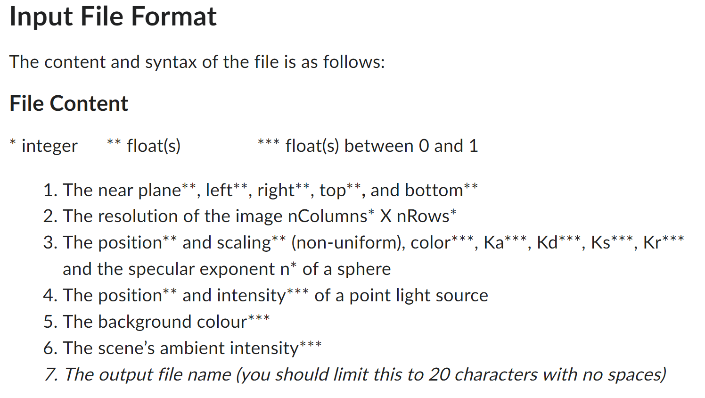
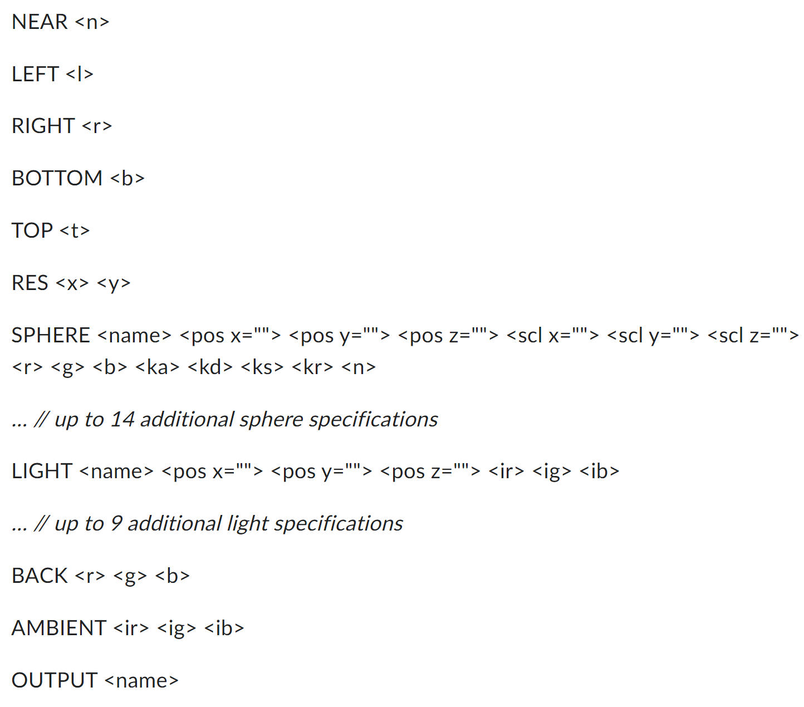

# Ray-Tracer

Name: Omar Madhani (Computer Science 305)

12/2/2023

Hi! I have chosen to make my ray tracer in Python.

I have made it using Python version 3.11.6, so please ensure that my program is run with a compatible version. The program also requires the installation of numpy.

The program is a single file called RayTracer.py and can be run with an object and lighting parameter input file by typing:

**python RayTracer.py inputFileName.txt**

Say the input file was called testDiffuse.txt, for example. To run the program, you would type:

python RayTracer.py testDiffuse.txt

The program expects that the test case is placed in the same folder as the program.

RayTracer.py assumes that the filename entered in the command line exists in the folder. The program also expects that the input file follows the conventions of the assignment description below.

I also have placed .ppm renderings of a few test cases in the repository. However, they will be overwritten when the program is re-run on these input files. For my testing, I have opened the .ppm files using GIMP.

You will know when RayTracer.py has created the .ppm file when it prints the output file name in the terminal. The time to run the program on a given file may vary depending on the conditions of your device.

ADS and shadows have been implemented, but reflections still have to be completed.

Thank you! 
